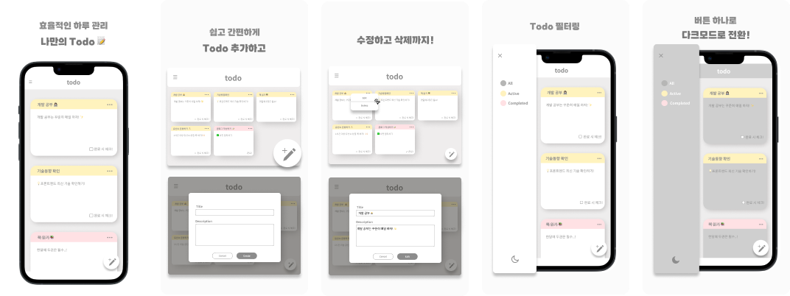

# My Todo 🗓

### 프로젝트 소개

> **Todo-Service** 는 사용자가 일정 관리를 편리하게 하고, 일정을 한눈에 쉽게 볼 수 있는 웹 애플리케이션입니다.    
> 기존 사용하던 여러 Todo 앱을 사용하며 느낀 불편한 점을 고려하여 사용자 경험에 대해 고민하고, 일정 관리가 쉽고 편한 Todo를 만들기 위해 시작한 프로젝트입니다.   
> **Todo-SerVice** 는 단기 프로젝트로 기획부터 디자인, 개발까지 모두 혼자하는 것을 목표로 진행하였습니다. 

### 진행 기간

📄 기획  
- **2024.03.12 - 2024.03.14**

📚 디자인  
- **2024.03.15 - 2024.03.20**

👩🏻‍💻 개발  
- **2024.03.21 - 2024.03.30**

### 기술 스택

- 
  
  
  
  

### 주요 기능

|Create|                                               Edit                                                |
|:-:|:-------------------------------------------------------------------------------------------------:|
| | |
|Delete|                                             Darkmode                                              |
|| |

- Todo CRUD
- Filtering
- Dark mode

### 배포 링크

- [🔗 배포 사이트로 이동하기](https://todo.jung-gyeongju.com)

### 프로젝트 후기 🙇🏻‍♀️

- 사용자 경험에 대한 이해 심화
  - 직접 여러 Todo 애플리케이션을 사용하며 느낀 불편함들을 개선하기 위해 노력했습니다.
  - 이러한 경험을 바탕으로 쉽고 편리하게 일정을 관리할 수 있도록 UI/UX 디자인을 최적화했습니다.
  - 간단하고 직관적인 인터페이스를 구현하기 위해 많은 고민과 테스트를 거쳤고, 이를 통해 사용자의 관점에서 생각하는 능력이 향상되었습니다.
- 기술 학습과 프로젝트 적용의 중요성
  - 예전에 학습한 `React` 를 이번 프로젝트에 적용하면서 기술을 실제로 활용하는 중요성을 깨달았습니다.
  - `React` 의 기본 개념부터 다양한 기능들을 스스로 복습하고 실제 프로젝트에 적용해보는 과정에서 실전적인 학습의 효과를 경험했습니다.
- 반응형 웹 디자인의 필요성
  - 다양한 디바이스에서 일관된 사용자 경험을 제공하기 위해 반응형 웹 디자인의 중요성을 깨달았습니다.
  - 이를 구현하기 위해 `CSS Media Queries` 와 `Styled-Component` 를 효과적으로 활용하였고, 이를 통해 모바일 및 데스크톱 환경에서 모두 최적화된 웹사이트를 제작할 수 있었습니다.

### Documents

- [Notion](https://www.notion.so/gyeongju/Todo-Service-afea5e1f5c5a44cd9c53910ae3a08576?pvs=4)
- [Figma](https://www.figma.com/file/pUqMQkXPpaZtXJSSrktPhQ/Todo?type=design&node-id=0%3A1&mode=dev&t=AxyoVvZ1IxoXZ3HW-1)
